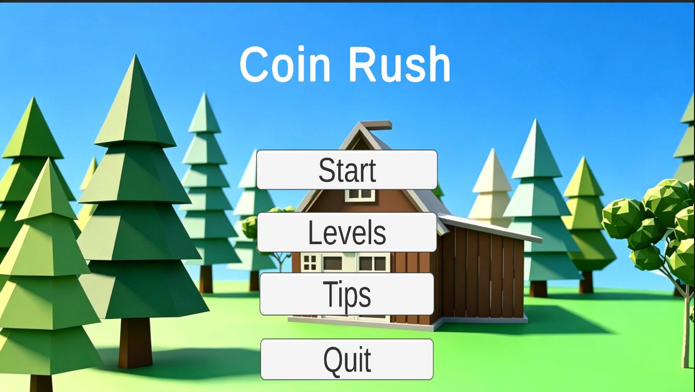
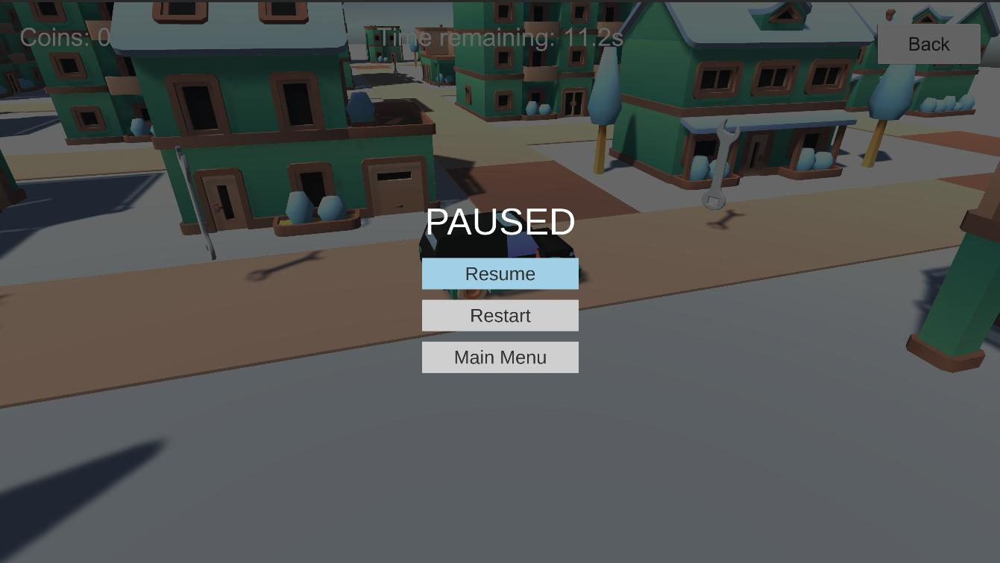
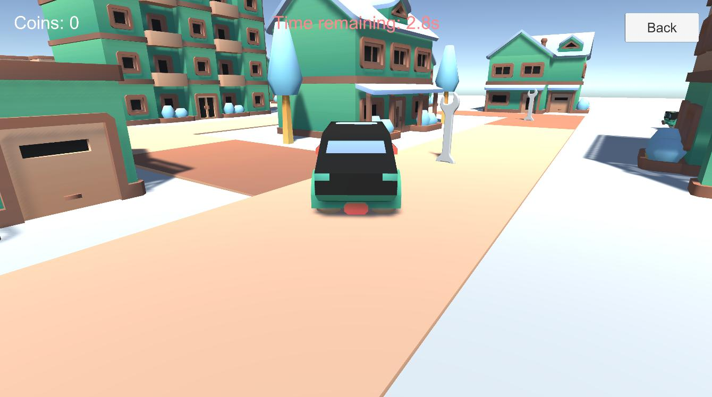

# Coin Rush V1.0

> 王昱宁、苏菩涵 | Unity 2022.3.8f1c1 | 2025–2026

---

## 开发记录

**跨场景单例对象引用丢失**

GameManager、ScoreManager 等使用 `DontDestroyOnLoad` 保留的对象，在场景切换后场景内 UI 引用丢失，导致分数文本显示为空白。解决方案是在 `OnSceneLoaded` 中遍历 Canvas 下的 Text 组件，按关键词（coin / score）重新绑定引用。

**光标锁定异常**

第三人称关卡中鼠标光标需要隐藏并锁定，但按下 Esc 打开暂停菜单后，光标解锁后无法重新锁定。经查是 `CursorLockMode` 与 `Cursor.visible` 状态不同步所致，增加状态判断并强制重新锁定后恢复正常。

**汽车关卡相机抖动**

初期使用 `Camera.main` 直接跟随车辆，转向时出现明显抖动。后在 `LateUpdate` 中采用 `Quaternion.Slerp` 平滑插值，并通过 `Clamp(-maxPitchAngle, maxPitchAngle)` 限制俯仰角，相机跟随手感得以改善。同时增加了 `LeftAlt` 临时解锁光标功能，便于调试与截图。

**音效资源获取**

未找到合适的外部音效素材，因此自行实现 `SimpleSFXGenerator`，运行时通过代码生成 `AudioClip`。金币音效采用双音调上升设计（三角波混正弦波），过关与失败音效分别基于 C 大调与 G-E-C 下行音阶生成。

**暂停菜单 UI 层级冲突**

初期在场景既有 Canvas 上添加按钮，与关卡内 Back 按钮发生层级冲突。后改为代码动态创建独立 PauseCanvas，设置 `sortingOrder = 100` 保证最上层显示，并自行配置半透明遮罩与功能按钮，实现各关卡统一复用。

**多角色控制系统拆分**

Level1 至 Level4 分别对应汽车、人形、潜艇、UFO 四种角色，各角色移动逻辑与相机跟踪方式不同。因此拆分为 `VehicleController`、`PlayerController`、`ufoController` 独立脚本，未合并为单一文件。该方案增加了场景配置工作量，但保证了代码结构的清晰性。

## 项目结构

```
Assets/
├── Scenes/
│   ├── Main Menu.unity        # 主菜单，Start/Levels/Tips/Quit
│   ├── Level1.unity           # 汽车驾驶（城镇）
│   ├── Level2.unity           # 人形行走（森林）
│   ├── Level3.unity           # 潜艇水下
│   ├── Level4.unity           # UFO 太空
│   ├── Success.unity          # 过关结算
│   └── Gameover.unity         # 失败结算
├── Scripts/
│   ├── GameManager.cs         # 关卡切换、计时器、胜负判定
│   ├── ScoreManager.cs        # 金币计数 + 最高分存档（PlayerPrefs）
│   ├── AudioManager.cs        # BGM / SFX 管理，含代码生成音效
│   ├── PauseMenu.cs           # 全局暂停菜单（代码动态创建 UI）
│   ├── LevelPauseMenu.cs      # 部分关卡的独立暂停处理
│   ├── MainMenuController.cs  # 主菜单按钮事件绑定
│   ├── PlayerController.cs    # 人形角色（含 IK 脚部适配）
│   ├── VehicleController.cs   # 汽车操控 + 跟随相机
│   ├── CharacterMover.cs      # 简化版人形移动（另一套动画逻辑）
│   ├── ufoController.cs       # UFO 移动
│   ├── ufoCameraController.cs # UFO 第三人称相机
│   ├── Coin.cs                # 金币自转、浮动、触发加分
│   ├── CountdownUI.cs         # 倒计时显示（时间不足变红闪烁）
│   ├── GameResultUI.cs        # 结算界面分数显示
│   ├── BackToMenuButton.cs    # 返回主菜单按钮通用脚本
│   ├── ShowCursorOnResult.cs  # 结算场景强制显示鼠标
│   ├── RuntimeInitializer.cs  # 编辑器直接运行时自动初始化单例
│   └── SimpleSFXGenerator.cs  # 纯代码生成 8-bit 风格音效
```

## 运行方式

1. 用 **Unity 2022.3.8f1c1** 打开项目。
2. 在 `File -> Build Settings` 里确认 `Main Menu` 和 4 个 Level 场景已加入 Build。
3. 直接 Play 运行，或 Build 成 Standalone / WebGL。

WebGL 版本构建后，把 `Team13_project/index.html` 和 `Build/` 目录一起部署即可。

## 操作说明

| 按键 | 功能 |
|------|------|
| `WASD` / 方向键 | 移动 |
| `鼠标` | 旋转视角 |
| `Esc` | 打开/关闭暂停菜单 |
| `Left Alt` | 临时解锁鼠标 |
| `Left Ctrl` | 切换走/跑（人形关卡） |
| `Left Shift` | 冲刺（人形关卡） |

## 游戏截图

**图 1**：主菜单界面。Coin Rush 标题、Start / Levels / Tips / Quit 四个按钮，背景是 Lowpoly 风格的树林和小屋。



**图 2**：游戏暂停界面。半透明黑色遮罩，显示 PAUSED 标题和 Resume / Restart / Main Menu 三个按钮。



**图 3**：Level 1 汽车驾驶关卡。玩家操控绿色小汽车在城镇道路上行驶，收集路边的金币。



**图 4**：Level 2 角色行走关卡。人形角色在草地森林场景中行走，金币散布在小屋附近。


**图 5**：Level 3 水下场景关卡。黄色潜艇在浅蓝色海洋中航行，周围有岩石和珊瑚。


**图 6**：Level 4 太空场景关卡。UFO 在紫色星空中飞行，背景有带光环的星球和小行星。


---

## 软著信息

- **游戏名称**：Coin Rush V1.0
- **开发完成日期**：2026 年
- **第一著作人（著作权人）**：王昱宁
- **著作人**：王昱宁、苏菩涵

### 分工说明

**王昱宁（第一著作人）**

负责软件整体架构设计、核心游戏逻辑开发与功能实现。主要完成：
- 游戏主体框架搭建（单例管理器、跨场景持久化）
- 玩家角色运动与控制系统（人形走跑跳 + IK、汽车驾驶、UFO 飞行）
- 碰撞检测与物理逻辑（金币触发、刚体移动）
- 关卡规则设计（4 关难度递进、过关/失败判定）
- 计分与胜负判定系统（实时计分、最高分存档）
- 核心 UI 交互功能开发（主菜单、暂停菜单、结算界面）
- 代码调试优化与整体功能整合
- 主导项目全流程开发与版本迭代

**苏菩涵**

负责游戏美术资源与视听效果制作。主要完成：
- 游戏场景建模与 Lowpoly 风格美术调整
- 游戏界面素材适配与美化
- 配乐制作与音效资源制作导入配置
- 基础动画效果调试（金币旋转浮动、UI 过渡）

---

# Coin Rush V1.0 (English)

> Wang Yuning, Su Pohan | Unity 2022.3.8f1c1 | 2025–2026

---

## Development Notes

**Singleton Object Reference Loss Across Scenes**

GameManager, ScoreManager, and other `DontDestroyOnLoad` objects persisted through scene transitions but lost their UI references in the new scene, causing score text to display as blank. The solution was to traverse Text components under the Canvas in `OnSceneLoaded`, matching keywords such as "coin" or "score", and rebind the references accordingly.

**Cursor Locking Anomaly**

In third-person levels, the mouse cursor is hidden and locked. After pressing Esc to open the pause menu, the cursor would occasionally fail to re-lock. Investigation revealed that `CursorLockMode` and `Cursor.visible` were desynchronized. Adding a state check to force re-locking resolved the issue.

**Car Level Camera Jitter**

Initially, `Camera.main` directly followed the vehicle, resulting in noticeable jitter during turns. The camera was later updated to use `Quaternion.Slerp` for smooth interpolation in `LateUpdate`, with pitch clamped via `Clamp(-maxPitchAngle, maxPitchAngle)`. A `LeftAlt` temporary cursor unlock was also added for debugging and screenshot purposes.

**Audio Asset Acquisition**

No suitable external audio assets were available, so `SimpleSFXGenerator` was implemented to generate `AudioClip` at runtime. The coin sound uses a dual-tone rising arpeggio (triangle mixed with sine wave). Success and failure sounds are based on C major and G-E-C descending scales respectively.

**Pause Menu UI Layer Conflict**

Buttons added to the existing scene Canvas conflicted with the level's Back button in terms of click priority. The approach was changed to dynamically spawn an independent PauseCanvas with `sortingOrder = 100`, ensuring top-layer rendering, along with a semi-transparent overlay and functional buttons. This design allows uniform reuse across all levels.

**Multi-Character Control System Separation**

Levels 1 through 4 use car, humanoid, submarine, and UFO respectively, each with distinct movement logic and camera tracking. Controllers were separated into `VehicleController`, `PlayerController`, and `ufoController` rather than merged into a single file. This increases scene configuration overhead but maintains code clarity.

## Project Structure

```
Assets/
├── Scenes/
│   ├── Main Menu.unity        # Main menu with Start/Levels/Tips/Quit
│   ├── Level1.unity           # Car driving (town)
│   ├── Level2.unity           # Humanoid walking (forest)
│   ├── Level3.unity           # Submarine underwater
│   ├── Level4.unity           # UFO in space
│   ├── Success.unity          # Level cleared screen
│   └── Gameover.unity         # Game over screen
├── Scripts/
│   ├── GameManager.cs         # Scene switching, timer, win/lose logic
│   ├── ScoreManager.cs        # Coin count + high score (PlayerPrefs)
│   ├── AudioManager.cs        # BGM / SFX manager with runtime-generated sounds
│   ├── PauseMenu.cs           # Global pause menu (spawns UI dynamically)
│   ├── LevelPauseMenu.cs      # Per-level pause handling
│   ├── MainMenuController.cs  # Main menu button events
│   ├── PlayerController.cs    # Humanoid (with foot IK)
│   ├── VehicleController.cs   # Car controls + follow camera
│   ├── CharacterMover.cs      # Simplified humanoid movement
│   ├── ufoController.cs       # UFO movement
│   ├── ufoCameraController.cs # UFO third-person camera
│   ├── Coin.cs                # Coin rotation, floating, trigger scoring
│   ├── CountdownUI.cs         # Countdown display (flashes red when low)
│   ├── GameResultUI.cs        # Result screen score display
│   ├── BackToMenuButton.cs    # Generic back-to-menu button
│   ├── ShowCursorOnResult.cs  # Force show cursor on result screens
│   ├── RuntimeInitializer.cs  # Auto-init singletons when running from editor
│   └── SimpleSFXGenerator.cs  # Pure code 8-bit style sound generation
```

## How to Run

1. Open the project in **Unity 2022.3.8f1c1**.
2. In `File -> Build Settings`, make sure `Main Menu` and all 4 Level scenes are in the build.
3. Hit Play, or build to Standalone / WebGL.

For WebGL, deploy `Team13_project/index.html` along with the `Build/` folder.

## Controls

| Key | Action |
|-----|--------|
| `WASD` / Arrow keys | Move |
| `Mouse` | Rotate camera |
| `Esc` | Open / close pause menu |
| `Left Alt` | Temporarily unlock cursor |
| `Left Ctrl` | Toggle walk / run (humanoid levels) |
| `Left Shift` | Sprint (humanoid levels) |

## Screenshots

**Fig 1**: Main menu. Coin Rush title, Start / Levels / Tips / Quit buttons, Lowpoly forest background.


**Fig 2**: Pause screen. Semi-transparent black overlay, PAUSED title, Resume / Restart / Main Menu buttons.


**Fig 3**: Level 1 — Car driving. Player drives a green car through a town, collecting coins along the road.


**Fig 4**: Level 2 — Humanoid walking. Character walks through a grassland forest, coins scattered near cabins.


**Fig 5**: Level 3 — Underwater. Yellow submarine sails through light-blue ocean, rocks and coral around.


**Fig 6**: Level 4 — Space. UFO flies through a purple starfield, ringed planets and asteroids in the background.


---

## Copyright Info

- **Game Title**: Coin Rush V1.0
- **Completion Date**: 2026
- **First Author (Copyright Holder)**: Wang Yuning
- **Authors**: Wang Yuning, Su Pohan

### Division of Labor

**Wang Yuning (First Author)**

Responsible for overall architecture design and core game logic. Main contributions:
- Game framework (singleton managers, cross-scene persistence)
- Player movement and control systems (humanoid walk/run/jump + IK, car driving, UFO flight)
- Collision detection and physics (coin triggers, rigidbody movement)
- Level design (4 levels with progressive difficulty, win/lose conditions)
- Scoring and win/lose system (real-time scoring, high score save)
- Core UI development (main menu, pause menu, result screen)
- Code debugging, optimization, and overall integration
- Led full project lifecycle and version iteration

**Su Pohan**

Responsible for art assets and audiovisual production. Main contributions:
- Scene modeling and Lowpoly style art refinement
- UI asset adaptation and polishing
- Soundtrack and SFX production, import, and configuration
- Basic animation tuning (coin rotation/floating, UI transitions)
