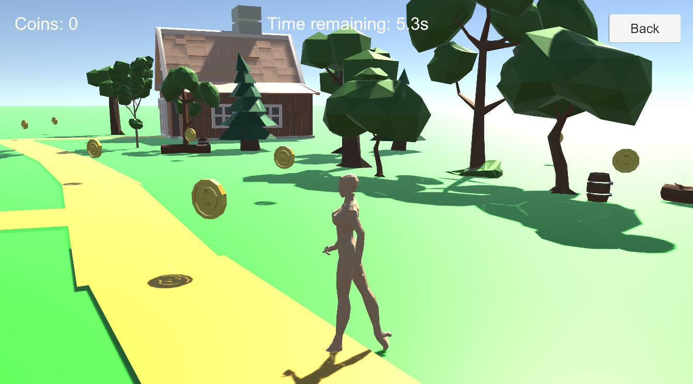
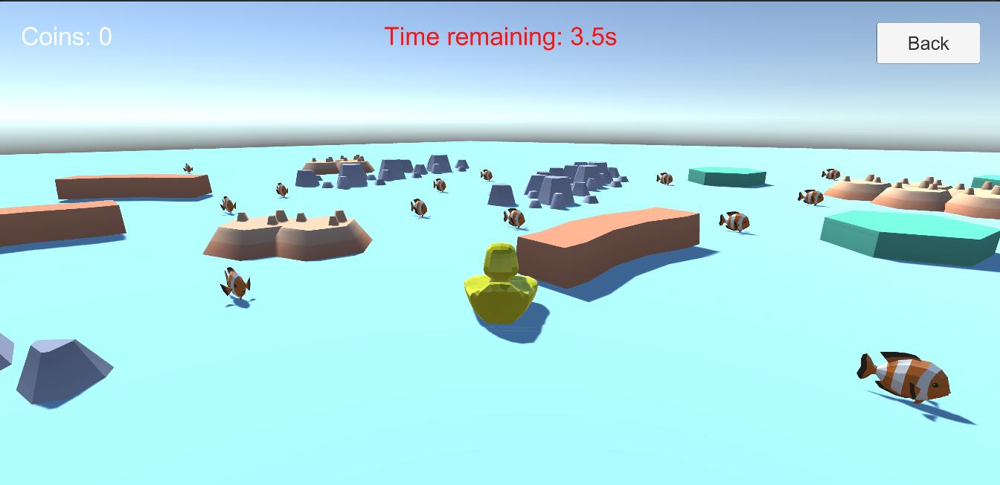
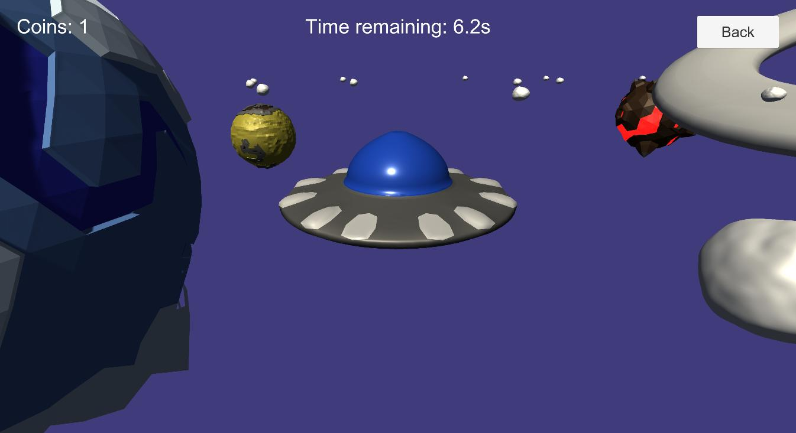
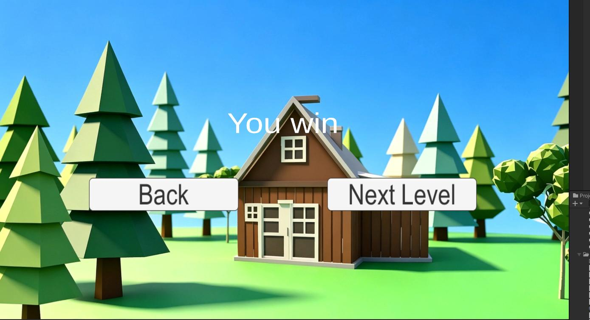
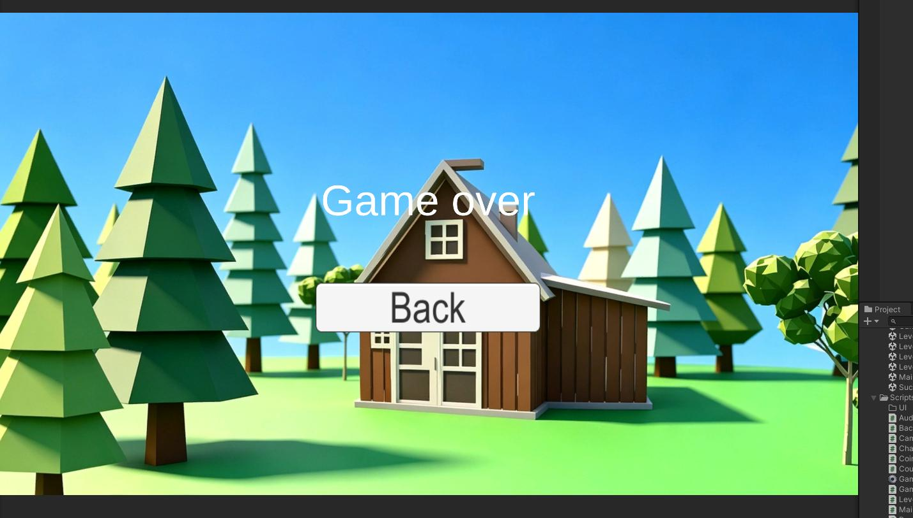

# Coin Rush V1.0

> A 3D coin-collection arcade game built with Unity — drive, walk, dive, and fly through four distinct worlds to collect coins before time runs out.

---

## 1. Project Overview

**Coin Rush** is a fast-paced 3D coin-collection game developed in Unity. Players take control of four different vehicles/characters — a car, a humanoid, a submarine, and a UFO — across four themed levels, racing against a countdown timer to collect as many coins as possible. The game is designed for casual players who enjoy quick, arcade-style challenges with varied gameplay mechanics.

---

## 2. Preview


*Main menu — Coin Rush title screen with Start, Levels, Tips, and Quit buttons, set against a Lowpoly forest and cabin background.*


*Level 1 — Drive a green car through a town, collecting coins scattered along the roads and between buildings.*


*Level 2 — Control a humanoid character walking and running through a grassy forest, with coins placed near cabins and trees.*


*Level 3 — Navigate a yellow submarine through a light-blue ocean, surrounded by rocks, coral, and underwater terrain.*


*Level 4 — Fly a UFO through a purple starfield, with ringed planets and asteroids in the background.*


*Pause menu — Semi-transparent black overlay with PAUSED title and Resume, Restart, and Main Menu buttons.*


*Success screen — Shown when the player collects enough coins before time runs out, with options to continue or return to menu.*


*Game Over screen — Shown when the player fails to reach the score threshold, with an option to retry or return to menu.*

---

## 3. Core Features

- **4 Unique Levels** — Each level features a different controllable character (car, humanoid, submarine, UFO) with its own movement physics, solving the problem of repetitive gameplay in single-mechanic coin collectors.
- **Real-Time Countdown Timer** — Each level has a time limit. The timer flashes red when time is low, creating urgency and tension.
- **Score System with Persistent High Score** — Coin counts are tracked per level and the highest score is saved locally via `PlayerPrefs`, giving players a goal to beat.
- **Dynamic Pause Menu** — A code-generated pause UI with Resume, Restart, and Main Menu options, ensuring consistent behavior across all levels without scene-specific setup.
- **Pure Code-Generated Audio** — All sound effects and background music are synthesized at runtime using mathematical waveforms (triangle, sine, square waves), eliminating the need for external audio assets.
- **Third-Person Camera with Mouse Control** — Free-look camera rotation with smooth interpolation and pitch clamping, plus a temporary cursor unlock (Left Alt) for debugging.
- **Foot IK System (Humanoid Level)** — Real-time inverse kinematics adapts the character's feet to uneven terrain, with configurable IK modes (Off / Walk-Idle / Global).
- **Level Progression** — Completing a level with enough coins unlocks the next, with a "Next Level" button on the success screen.

---

## 4. Quick Start

### Requirements

- **Unity 2022.3.8f1c1** (or compatible 2022.3.x LTS)
- Windows / macOS / WebGL

### Setup & Run

```bash
# 1. Clone the repository
git clone <your-repo-url>
cd coin-rush

# 2. Open in Unity Hub
# Add the project folder and open with Unity 2022.3.8f1c1

# 3. Ensure build scenes are configured
# File -> Build Settings -> Add: Main Menu, Level1, Level2, Level3, Level4

# 4. Press Play in the Editor, or build to Standalone / WebGL
```

### WebGL Deployment

After building for WebGL, deploy the `index.html` together with the `Build/` folder to any static file server.

---

## 5. Controls

| Key | Action |
|-----|--------|
| `WASD` / Arrow Keys | Move |
| `Mouse` | Rotate camera |
| `Esc` | Open / close pause menu |
| `Left Alt` | Temporarily unlock cursor |
| `Left Ctrl` | Toggle walk / run (humanoid levels) |
| `Left Shift` | Sprint (humanoid levels) |
| `I` | Cycle IK mode (humanoid level) |

### Typical Gameplay Flow

1. Start from the **Main Menu** — click Start to begin Level 1, or Levels to choose a specific level.
2. In each level, **collect coins** scattered throughout the environment within the time limit.
3. If you collect enough coins (>= 10 by default) when time runs out, you **pass the level** and proceed to the next.
4. If you fail to reach the threshold, you see the **Game Over** screen and can retry.

---

## 6. Technical Architecture

### Architecture Diagram

```
┌─────────────────────────────────────────────────┐
│                  Unity Scenes                     │
│  Main Menu │ Level1~4 │ Success │ Gameover       │
└──────────────────────┬──────────────────────────┘
                       │
┌──────────────────────▼──────────────────────────┐
│            Singleton Managers (DontDestroyOnLoad) │
│  ┌──────────────┐ ┌──────────────┐ ┌──────────┐ │
│  │ GameManager  │ │ ScoreManager │ │AudioMgr  │ │
│  │ - scene flow │ │ - coin count │ │- BGM/SFX │ │
│  │ - timer      │ │ - high score │ │          │ │
│  │ - win/lose   │ │              │ │          │ │
│  └──────────────┘ └──────────────┘ └──────────┘ │
│  ┌──────────────┐                               │
│  │ PauseMenu    │                               │
│  │ - dynamic UI │                               │
│  └──────────────┘                               │
└──────────────────────┬──────────────────────────┘
                       │
┌──────────────────────▼──────────────────────────┐
│              Per-Level Controllers                │
│  ┌──────────────┐ ┌──────────────┐ ┌──────────┐ │
│  │VehicleCtrl   │ │PlayerCtrl    │ │ufoCtrl   │ │
│  │(Level 1)     │ │(Level 2)     │ │(Lv 3,4)  │ │
│  └──────────────┘ └──────────────┘ └──────────┘ │
│  ┌──────────────┐ ┌──────────────┐              │
│  │CameraCtrl    │ │ufoCameraCtrl │              │
│  └──────────────┘ └──────────────┘              │
└──────────────────────┬──────────────────────────┘
                       │
┌──────────────────────▼──────────────────────────┐
│                 Shared Components                 │
│  ┌──────┐ ┌──────────┐ ┌──────────────┐        │
│  │ Coin │ │CountdownUI│ │SimpleSFXGen  │        │
│  └──────┘ └──────────┘ └──────────────┘        │
└─────────────────────────────────────────────────┘
```

### Key Design Decisions

- **Singleton Pattern with `DontDestroyOnLoad`** — GameManager, ScoreManager, AudioManager, and PauseMenu persist across scene transitions, maintaining game state without reloading. This avoids complex data-passing between scenes but requires careful UI reference rebinding on each scene load.
- **Separated Character Controllers** — Rather than merging all movement logic into a single monolithic script, each character type has its own controller (`VehicleController`, `PlayerController`, `ufoController`). This keeps each script focused and readable, at the cost of some code duplication.
- **Code-Generated Audio** — `SimpleSFXGenerator` synthesizes all audio at runtime using procedural waveforms, removing the dependency on external audio files. This was a pragmatic choice when suitable audio assets were unavailable.
- **Dynamic UI Construction** — The pause menu is built entirely in code (`PauseMenu.cs`), ensuring it works identically across all scenes without manual prefab placement.

---

## 7. Core Modules

### 7.1 GameManager — Scene Flow & Timer

[GameManager.cs](./Assets/Scripts/GameManager.cs) is the central state machine. It manages:

- **Scene lifecycle**: On each scene load, it detects the scene type (level, result, or menu) and triggers the appropriate logic — starting the countdown, stopping music, resetting scores, etc.
- **Countdown timer**: A coroutine-driven countdown that updates the UI each frame. When time expires, it evaluates the player's score against the threshold and routes to Success or Gameover.
- **HUD auto-layout**: On level scenes, it programmatically repositions the score text, timer, and Back button to the top-left, top-center, and top-right of the screen using anchor-based `RectTransform` positioning.
- **Level progression**: After a success, it dynamically creates a "Next Level" button that loads the next scene in sequence.

### 7.2 PlayerController — Humanoid Movement & Foot IK

[PlayerController.cs](./Assets/Scripts/PlayerController.cs) handles the most complex character in the game:

- **Movement system**: Supports walk, run (toggle with Left Ctrl), and sprint (hold Left Shift), with camera-relative direction input. Uses `CharacterController.Move()` for collision-aware movement.
- **Animation blending**: Integrates with Unity's Animator via `OnAnimatorMove()`, combining root motion from animation clips with scripted movement for natural-looking locomotion.
- **Jump & landing**: Custom gravity with fall multiplier for tighter jump feel, plus landing detection that triggers a landing animation after sufficient air time.
- **Foot IK**: Uses Unity's `OnAnimatorIK` callback with raycast-based ground detection per foot. Three configurable modes:
  - **Off**: No IK
  - **WalkAndIdleOnly**: IK only when walking or idle
  - **Global**: IK always active (except during attack animations)
  
  The system raycasts downward from each foot position, adjusts position and rotation to match the terrain normal, and applies smooth weight transitions via `Mathf.Lerp`.

### 7.3 SimpleSFXGenerator — Procedural Audio Synthesis

[SimpleSFXGenerator.cs](./Assets/Scripts/SimpleSFXGenerator.cs) is a static utility that generates all game audio from mathematical waveforms:

- **Coin collect**: Dual-tone rising arpeggio (B5 → E6) using triangle wave mixed with sine, with fast attack and exponential decay envelope.
- **Level success**: Ascending C major arpeggio (C5 → E5 → G5 → C6) with gentle decay.
- **Level fail**: Descending G4 → E4 → C4 sequence with a somber tone.
- **Menu music**: 8-second loop with C major chord arpeggios and a bass root note, using triangle + sine wave mixing.
- **Gameplay music**: 4-second fast-paced loop in F minor with bassline, lead melody, and high-frequency arpeggio accents.

All clips are generated as `AudioClip` objects at 44100 Hz sample rate and cached in `AudioManager` at startup.

---

## 8. Challenges & Solutions

### 8.1 Cross-Scene UI Reference Loss

**Problem**: After transitioning from one level scene to another, `GameManager`, `ScoreManager` and other `DontDestroyOnLoad` singletons lost their references to UI Text components in the new scene, causing the score display and timer to show blank.

**Attempts**:
1. Storing references in `OnDestroy` and restoring them later — failed because Unity destroys the old scene's objects before the new scene's `OnSceneLoaded` call.
2. Using `FindObjectOfType<Text>()` in `Start()` — failed because singletons are created before scene objects are fully initialized.

**Final Solution**: Hooked into `SceneManager.sceneLoaded` event. When a new scene loads, the manager traverses all Canvas children to find UI elements by keyword matching (e.g., "coin", "score", "back", "menu"). This approach is robust to different scene configurations and automatically rebinds references on every scene transition.

### 8.2 Car Level Camera Jitter

**Problem**: In Level 1, the camera following the car exhibited visible jitter during turns, especially at higher speeds.

**Attempts**:
1. Moving camera logic to `Update()` — still jittered because `Update` and `FixedUpdate` are out of sync.
2. Using `Rigidbody.position` directly — not smooth enough.

**Final Solution**: Moved camera position update to `LateUpdate()`, which runs after all physics and animation updates. Applied `Quaternion.Slerp` for smooth rotation interpolation and clamped the pitch angle to prevent the camera from flipping over. Also added `LeftAlt` temporary cursor unlock for debugging camera behavior.

### 8.3 Pause Menu UI Layer Conflicts

**Problem**: When adding pause buttons to the existing scene Canvas, they conflicted with in-level Back buttons — click events were intercepted or buttons appeared behind other UI elements.

**Attempts**:
1. Adding buttons directly to the scene Canvas — caused layer conflicts and required per-scene configuration.
2. Using a separate Canvas as a child of the scene Canvas — sorting order was unreliable.

**Final Solution**: The pause menu is now entirely code-generated in `PauseMenu.cs`. It creates an independent `PauseCanvas` with `sortingOrder = 100`, ensuring it renders on top of all scene UI. The canvas includes a semi-transparent overlay, PAUSED title, and three functional buttons. This approach is scene-independent and requires zero manual setup for new levels.

### 8.4 Cursor Locking Anomaly

**Problem**: In third-person levels, the mouse cursor is hidden and locked. After pressing Esc to open the pause menu, the cursor would occasionally fail to re-lock when resuming gameplay.

**Attempts**:
1. Simply calling `Cursor.lockState = CursorLockMode.Locked` after unpausing — inconsistent results.
2. Toggling `Cursor.visible` separately — didn't help because the two properties were desynchronized.

**Final Solution**: Identified that `CursorLockMode` and `Cursor.visible` were out of sync. Added a state check in the pause logic to force both properties to the correct values simultaneously: when pausing, set both to unlocked/visible; when resuming, set both to locked/hidden. This synchronized approach resolved the issue reliably.

### 8.5 Audio Asset Acquisition

**Problem**: No suitable external audio assets were available for sound effects or background music. Using third-party audio files would introduce licensing concerns and increase project size.

**Attempts**:
1. Searching free audio libraries — found nothing matching the desired 8-bit arcade style.
2. Recording custom sounds — impractical without proper audio equipment.

**Final Solution**: Implemented `SimpleSFXGenerator`, a static utility that synthesizes all game audio at runtime from mathematical waveforms. The coin collect sound uses a dual-tone rising arpeggio (B5 → E6, triangle wave mixed with sine). The level success jingle is based on an ascending C major arpeggio (C5 → E5 → G5 → C6), while the failure sound uses a descending G-E-C sequence. Both menu and gameplay background music are procedurally generated loops. This approach eliminates external dependencies entirely and produces a cohesive 8-bit aesthetic.

### 8.6 Multi-Character Control System Separation

**Problem**: Levels 1 through 4 feature four distinct controllable characters — a car, a humanoid, a submarine, and a UFO — each with fundamentally different movement physics and camera tracking requirements. A single unified controller would become overly complex and difficult to maintain.

**Attempts**:
1. Creating a single `CharacterController` base class with mode switching — the movement logic diverged too much between vehicle physics (Rigidbody-based) and character physics (CharacterController-based), making the code hard to follow.
2. Using ScriptableObject-based configuration to swap behaviors — added unnecessary abstraction for only four character types.

**Final Solution**: Separated controllers into dedicated scripts: `VehicleController` for the car, `PlayerController` for the humanoid, and `ufoController` for the submarine and UFO (which share similar hovering mechanics). Each controller is self-contained with its own camera logic. This approach increases the number of files and requires per-scene component assignment, but keeps each script focused, readable, and independently debuggable.

---

## 9. Project Structure

```
coin-rush/
├── Assets/
│   ├── Scenes/
│   │   ├── Main Menu.unity        # Main menu (Start / Levels / Tips / Quit)
│   │   ├── Level1.unity           # Car driving in a town
│   │   ├── Level2.unity           # Humanoid walking in a forest
│   │   ├── Level3.unity           # Submarine underwater
│   │   ├── Level4.unity           # UFO in outer space
│   │   ├── Success.unity          # Level cleared screen
│   │   └── Gameover.unity         # Game over screen
│   ├── Scripts/
│   │   ├── GameManager.cs         # Scene flow, countdown timer, win/lose logic
│   │   ├── ScoreManager.cs        # Coin counting + high score persistence
│   │   ├── AudioManager.cs        # BGM/SFX management with runtime fallback
│   │   ├── PauseMenu.cs           # Dynamic pause UI (code-generated)
│   │   ├── LevelPauseMenu.cs      # Per-level pause handling for Level 1/2
│   │   ├── MainMenuController.cs  # Main menu button event bindings
│   │   ├── PlayerController.cs    # Humanoid movement + foot IK
│   │   ├── VehicleController.cs   # Car driving + follow camera
│   │   ├── CharacterMover.cs      # Simplified humanoid movement (alternative)
│   │   ├── ufoController.cs       # UFO flight movement
│   │   ├── CameraController.cs    # Third-person camera follow
│   │   ├── ufoCameraController.cs # UFO-specific camera logic
│   │   ├── Coin.cs                # Coin rotation, floating, collision-trigger scoring
│   │   ├── CountdownUI.cs         # Countdown display with red flash warning
│   │   ├── GameResultUI.cs        # Result screen score display
│   │   ├── BackToMenuButton.cs    # Generic back-to-menu button
│   │   ├── ShowCursorOnResult.cs  # Force cursor visible on result screens
│   │   ├── RuntimeInitializer.cs  # Auto-init singletons in editor play mode
│   │   └── SimpleSFXGenerator.cs  # Procedural 8-bit audio synthesis
│   ├── Animation/                 # Humanoid animation clips & controllers
│   ├── Model/                     # 3D models (character, UFO, planets, stones)
│   ├── Prefab/                    # Prefabs (GameManager singleton, sword)
│   ├── Materials/                 # Materials and textures
│   └── TextMesh Pro/              # TextMeshPro assets
├── screenshots/                   # Game screenshots
└── README.md
```

---

## 10. Tech Stack & Dependencies

| Category | Technology |
|----------|-----------|
| Engine | Unity 2022.3.8f1c1 |
| Language | C# (.NET Standard 2.1) |
| UI | Unity UI (uGUI) + TextMeshPro |
| Physics | Unity Physics (CharacterController, Rigidbody) |
| Animation | Unity Animator + Humanoid IK |
| Audio | Pure code-generated (44100 Hz, PCM) |
| Persistence | PlayerPrefs |
| Rendering | Built-in Render Pipeline |
| Art Style | Lowpoly (procedural materials + free assets) |

---

## 11. License

This project is for personal/educational use. All rights reserved.

---

## 12. Project Background

This project was independently developed by **Wang Yuning** (王昱宁) as an extension of the earlier sandbox project *Grey Box Adventure*, driven by a personal interest in exploring diverse game mechanics and real-time interaction design within Unity.

---

# Coin Rush V1.0（中文）

> 一款基于 Unity 的 3D 金币收集街机游戏 — 驾驶、行走、潜水和飞行，穿越四个不同的世界，在倒计时结束前尽可能多地收集金币。

---

## 1. 项目简介

**Coin Rush** 是一款快节奏的 3D 金币收集游戏，使用 Unity 开发。玩家在四个主题关卡中操控四种不同的载具/角色——汽车、人形角色、潜艇和 UFO，在倒计时的压力下尽可能多地收集金币。游戏适合喜欢快节奏街机挑战的休闲玩家。

---

## 2. 效果预览


*主菜单 — Coin Rush 标题界面，包含 Start、Levels、Tips、Quit 四个按钮，背景为 Lowpoly 风格的树林和小屋。*


*Level 1 — 驾驶绿色汽车穿越城镇，收集散布在道路和建筑之间的金币。*


*Level 2 — 操控人形角色在草地森林中行走奔跑，金币分布在小屋和树木附近。*


*Level 3 — 操控黄色潜艇在浅蓝色海洋中航行，周围有岩石、珊瑚和水下地形。*


*Level 4 — 在紫色星空中驾驶 UFO 飞行，背景有带光环的星球和小行星。*


*暂停菜单 — 半透明黑色遮罩，显示 PAUSED 标题以及 Resume、Restart、Main Menu 三个按钮。*


*过关结算界面 — 在倒计时结束前收集足够金币后显示，可选择继续或返回主菜单。*


*失败结算界面 — 未达到分数门槛时显示，可选择重新挑战或返回主菜单。*

---

## 3. 核心功能

- **4 个独特关卡** — 每个关卡有不同角色（汽车、人形、潜艇、UFO），各自拥有独立的移动物理，解决了单一玩法金币收集游戏的重复性问题。
- **实时倒计时** — 每关有时间限制。剩余时间不足 5 秒时，计时器变红闪烁，营造紧迫感。
- **计分系统与最高分持久化** — 金币数量实时追踪，最高分通过 `PlayerPrefs` 本地保存，给玩家提供挑战目标。
- **动态暂停菜单** — 纯代码生成的暂停 UI，包含 Resume、Restart、Main Menu 选项，无需为每个场景单独配置。
- **纯代码音效生成** — 所有音效和背景音乐均通过数学波形（三角波、正弦波、方波）在运行时合成，无需外部音频资源。
- **第三人称鼠标控制相机** — 自由视角旋转，平滑插值，俯仰角限制，支持 Left Alt 临时解锁光标。
- **脚部 IK 系统（人形关卡）** — 实时反向运动学使角色脚部适应不平坦地形，支持三种可配置模式（关闭 / 仅走和待机 / 全局）。
- **关卡递进** — 收集足够金币即可解锁下一关，过关界面提供 "Next Level" 按钮。

---

## 4. 快速开始

### 环境要求

- **Unity 2022.3.8f1c1**（或兼容的 2022.3.x LTS 版本）
- Windows / macOS / WebGL

### 安装与运行

```bash
# 1. 克隆仓库
git clone <your-repo-url>
cd coin-rush

# 2. 在 Unity Hub 中打开
# 添加项目文件夹，使用 Unity 2022.3.8f1c1 打开

# 3. 确认构建场景已配置
# File -> Build Settings -> 添加：Main Menu, Level1, Level2, Level3, Level4

# 4. 在编辑器中按 Play 运行，或构建为 Standalone / WebGL
```

### WebGL 部署

构建 WebGL 版本后，将 `index.html` 与 `Build/` 目录一起部署到任意静态文件服务器即可。

---

## 5. 操作说明

| 按键 | 功能 |
|------|------|
| `WASD` / 方向键 | 移动 |
| `鼠标` | 旋转视角 |
| `Esc` | 打开/关闭暂停菜单 |
| `Left Alt` | 临时解锁鼠标光标 |
| `Left Ctrl` | 切换走/跑（人形关卡） |
| `Left Shift` | 冲刺（人形关卡） |
| `I` | 切换 IK 模式（人形关卡） |

### 典型游戏流程

1. 从**主菜单**开始 — 点击 Start 开始 Level 1，或点击 Levels 选择特定关卡。
2. 在每个关卡中，在倒计时结束前**收集散布在场景中的金币**。
3. 时间耗尽时，如果收集的金币足够多（默认 >= 10），则**过关**进入下一关。
4. 如果未达到门槛，则进入 **Game Over** 界面，可重新挑战。

---

## 6. 技术架构与设计

### 架构图

```
┌─────────────────────────────────────────────────┐
│                  Unity 场景                       │
│  Main Menu │ Level1~4 │ Success │ Gameover       │
└──────────────────────┬──────────────────────────┘
                       │
┌──────────────────────▼──────────────────────────┐
│          单例管理器（DontDestroyOnLoad）           │
│  ┌──────────────┐ ┌──────────────┐ ┌──────────┐ │
│  │ GameManager  │ │ ScoreManager │ │AudioMgr  │ │
│  │ - 场景流转   │ │ - 金币计数   │ │- BGM/SFX │ │
│  │ - 计时器     │ │ - 最高分     │ │          │ │
│  │ - 胜负判定   │ │              │ │          │ │
│  └──────────────┘ └──────────────┘ └──────────┘ │
│  ┌──────────────┐                               │
│  │ PauseMenu    │                               │
│  │ - 动态UI创建 │                               │
│  └──────────────┘                               │
└──────────────────────┬──────────────────────────┘
                       │
┌──────────────────────▼──────────────────────────┐
│              各关卡控制器                          │
│  ┌──────────────┐ ┌──────────────┐ ┌──────────┐ │
│  │VehicleCtrl   │ │PlayerCtrl    │ │ufoCtrl   │ │
│  │(Level 1)     │ │(Level 2)     │ │(Lv 3,4)  │ │
│  └──────────────┘ └──────────────┘ └──────────┘ │
│  ┌──────────────┐ ┌──────────────┐              │
│  │CameraCtrl    │ │ufoCameraCtrl │              │
│  └──────────────┘ └──────────────┘              │
└──────────────────────┬──────────────────────────┘
                       │
┌──────────────────────▼──────────────────────────┐
│                 共享组件                          │
│  ┌──────┐ ┌──────────┐ ┌──────────────┐        │
│  │ Coin │ │CountdownUI│ │SimpleSFXGen  │        │
│  └──────┘ └──────────┘ └──────────────┘        │
└─────────────────────────────────────────────────┘
```

### 关键设计取舍

- **单例模式 + `DontDestroyOnLoad`** — GameManager、ScoreManager、AudioManager 和 PauseMenu 在场景切换时保持存活，维护游戏状态而无需重新加载。这避免了复杂的场景间数据传递，但需要在每次场景加载时重新绑定 UI 引用。
- **分离的角色控制器** — 每种角色类型有独立的控制器脚本（`VehicleController`、`PlayerController`、`ufoController`），而非将所有移动逻辑合并到一个臃肿的脚本中。这使每个脚本保持专注和可读，代价是部分代码重复。
- **代码生成音频** — `SimpleSFXGenerator` 使用程序化波形在运行时合成所有音频，消除了对外部音频文件的依赖。这是在无法找到合适音频素材时的务实选择。
- **动态 UI 构建** — 暂停菜单完全通过代码构建（`PauseMenu.cs`），确保在所有场景中行为一致，无需手动放置预制体。

---

## 7. 核心模块

### 7.1 GameManager — 场景流转与计时器

[GameManager.cs](./Assets/Scripts/GameManager.cs) 是游戏的核心状态机。它负责：

- **场景生命周期管理**：在每次场景加载时，检测场景类型（关卡、结算界面或菜单），并触发相应逻辑——启动计时器、停止音乐、重置分数等。
- **倒计时器**：协程驱动的倒计时，每帧更新 UI。时间耗尽后，根据玩家分数是否达到阈值，跳转到 Success 或 Gameover 场景。
- **HUD 自动布局**：在关卡场景中，通过锚点定位自动将分数文本、计时器和 Back 按钮分别放置到屏幕左上角、顶部中央和右上角。
- **关卡递进**：过关后动态创建 "Next Level" 按钮，按顺序加载下一关。

### 7.2 PlayerController — 人形角色移动与脚部 IK

[PlayerController.cs](./Assets/Scripts/PlayerController.cs) 处理游戏中最复杂的角色：

- **移动系统**：支持走、跑（Left Ctrl 切换）和冲刺（按住 Left Shift），基于相机方向输入。使用 `CharacterController.Move()` 实现碰撞感知移动。
- **动画融合**：通过 `OnAnimatorMove()` 与 Unity Animator 集成，将动画片段的 root motion 与脚本移动结合，实现自然的运动表现。
- **跳跃与落地**：自定义重力配合下落倍增器，实现更紧凑的跳跃手感，落地检测在足够空中时间后触发落地动画。
- **脚部 IK**：使用 Unity 的 `OnAnimatorIK` 回调，结合每只脚的射线地面检测。三种可配置模式：
  - **Off**：不启用 IK
  - **WalkAndIdleOnly**：仅在行走或待机时启用 IK
  - **Global**：始终启用 IK（攻击动画除外）
  
  系统从每只脚的位置向下射线检测，根据地形法线调整位置和旋转，并通过 `Mathf.Lerp` 实现平滑的权重过渡。

### 7.3 SimpleSFXGenerator — 程序化音频合成

[SimpleSFXGenerator.cs](./Assets/Scripts/SimpleSFXGenerator.cs) 是一个静态工具类，通过数学波形生成所有游戏音频：

- **金币收集音效**：双音调上升琶音（B5 → E6），使用三角波混合正弦波，快速起音指数衰减包络。
- **过关音效**：上行 C 大调琶音（C5 → E5 → G5 → C6），柔和衰减。
- **失败音效**：下行 G4 → E4 → C4 音阶，营造沉重氛围。
- **主菜单音乐**：8 秒循环，C 大调和弦琶音加低音根音，三角波 + 正弦波混合。
- **游戏音乐**：4 秒快节奏 F 小调循环，包含低音线、主旋律和高频琶音点缀。

所有音频片段以 44100 Hz 采样率生成为 `AudioClip` 对象，并在启动时缓存于 `AudioManager` 中。

---

## 8. 难点攻克

### 8.1 跨场景 UI 引用丢失

**问题**：从一个关卡场景切换到另一个后，`GameManager`、`ScoreManager` 等 `DontDestroyOnLoad` 单例丢失了对新场景中 UI Text 组件的引用，导致分数和计时器显示空白。

**尝试过程**：
1. 在 `OnDestroy` 中存储引用，之后恢复——失败，因为 Unity 在调用 `OnSceneLoaded` 之前就已销毁旧场景对象。
2. 在 `Start()` 中使用 `FindObjectOfType<Text>()`——失败，因为单例在场景对象完全初始化之前就已创建。

**最终方案**：挂载到 `SceneManager.sceneLoaded` 事件。当新场景加载时，管理器遍历所有 Canvas 子对象，通过关键词匹配（如 "coin"、"score"、"back"、"menu"）查找 UI 元素。该方法对不同场景配置具有鲁棒性，并在每次场景切换时自动重新绑定引用。

### 8.2 汽车关卡相机抖动

**问题**：在 Level 1 中，跟随汽车的相机在转弯时出现明显抖动，高速时尤为严重。

**尝试过程**：
1. 将相机逻辑移至 `Update()`——仍然抖动，因为 `Update` 和 `FixedUpdate` 不同步。
2. 直接使用 `Rigidbody.position`——不够平滑。

**最终方案**：将相机位置更新移至 `LateUpdate()`（在所有物理和动画更新之后执行）。使用 `Quaternion.Slerp` 实现平滑旋转插值，并对俯仰角进行限制防止相机翻转。同时添加了 `LeftAlt` 临时解锁光标功能，便于调试相机行为。

### 8.3 暂停菜单 UI 层级冲突

**问题**：在场景已有 Canvas 上添加暂停按钮时，与关卡内 Back 按钮发生层级冲突——点击事件被拦截或按钮显示在其他 UI 元素后面。

**尝试过程**：
1. 直接在场景 Canvas 上添加按钮——造成层级冲突，且需要为每个场景单独配置。
2. 使用独立 Canvas 作为场景 Canvas 的子对象——排序层级不可靠。

**最终方案**：暂停菜单现在完全由 `PauseMenu.cs` 代码生成。它创建一个独立的 `PauseCanvas`，设置 `sortingOrder = 100`，确保渲染在所有场景 UI 之上。该 Canvas 包含半透明遮罩、PAUSED 标题和三个功能按钮。此方案与场景无关，新增关卡时无需任何手动配置。

### 8.4 光标锁定异常

**问题**：第三人称关卡中鼠标光标需要隐藏并锁定，但按下 Esc 打开暂停菜单后，光标解锁后无法重新锁定。

**尝试过程**：
1. 在取消暂停后直接调用 `Cursor.lockState = CursorLockMode.Locked`——结果不一致。
2. 单独切换 `Cursor.visible`——无效，因为两个属性状态不同步。

**最终方案**：经查是 `CursorLockMode` 与 `Cursor.visible` 状态不同步所致。在暂停逻辑中增加状态判断，同时强制同步两个属性：暂停时将两者设为解锁/可见，恢复时将两者设为锁定/隐藏，问题得以解决。

### 8.5 音效资源获取

**问题**：未找到合适的外部音效素材，使用第三方音频文件会引入版权问题并增加项目体积。

**尝试过程**：
1. 搜索免费音效库——未找到符合 8-bit 街机风格的需求。
2. 自行录制音效——缺乏专业音频设备，不可行。

**最终方案**：自行实现 `SimpleSFXGenerator`，运行时通过代码生成 `AudioClip`。金币音效采用双音调上升设计（B5 → E6，三角波混正弦波）。过关音效基于上行 C 大调琶音（C5 → E5 → G5 → C6），失败音效则使用下行 G-E-C 音阶。主菜单和游戏背景音乐均为程序化生成的循环片段。该方案完全消除了外部依赖，并形成统一的 8-bit 风格。

### 8.6 多角色控制系统拆分

**问题**：Level1 至 Level4 分别对应汽车、人形、潜艇、UFO 四种角色，各角色移动逻辑与相机跟踪方式差异巨大，统一控制器会变得过于复杂且难以维护。

**尝试过程**：
1. 创建单一 `CharacterController` 基类并通过模式切换——载具物理（基于 Rigidbody）与角色物理（基于 CharacterController）差异过大，代码难以阅读。
2. 使用 ScriptableObject 配置来切换行为——仅为四种角色类型引入了不必要的抽象层。

**最终方案**：拆分为 `VehicleController`（汽车）、`PlayerController`（人形）和 `ufoController`（潜艇和 UFO 共享悬浮机制）独立脚本，各自包含独立的相机逻辑。该方案增加了文件数量和场景配置工作量，但保证了每个脚本的专注性、可读性和独立调试能力。

---

## 9. 项目结构一览

```
coin-rush/
├── Assets/
│   ├── Scenes/
│   │   ├── Main Menu.unity        # 主菜单（Start / Levels / Tips / Quit）
│   │   ├── Level1.unity           # 汽车驾驶（城镇）
│   │   ├── Level2.unity           # 人形行走（森林）
│   │   ├── Level3.unity           # 潜艇水下
│   │   ├── Level4.unity           # UFO 太空
│   │   ├── Success.unity          # 过关结算
│   │   └── Gameover.unity         # 失败结算
│   ├── Scripts/
│   │   ├── GameManager.cs         # 场景流转、倒计时、胜负判定
│   │   ├── ScoreManager.cs        # 金币计数 + 最高分持久化
│   │   ├── AudioManager.cs        # BGM/SFX 管理，运行时回退生成
│   │   ├── PauseMenu.cs           # 动态暂停 UI（代码生成）
│   │   ├── LevelPauseMenu.cs      # Level 1/2 的独立暂停处理
│   │   ├── MainMenuController.cs  # 主菜单按钮事件绑定
│   │   ├── PlayerController.cs    # 人形角色移动 + 脚部 IK
│   │   ├── VehicleController.cs   # 汽车操控 + 跟随相机
│   │   ├── CharacterMover.cs      # 简化版人形移动（备用方案）
│   │   ├── ufoController.cs       # UFO 飞行移动
│   │   ├── CameraController.cs    # 第三人称相机跟随
│   │   ├── ufoCameraController.cs # UFO 专用相机逻辑
│   │   ├── Coin.cs                # 金币旋转、浮动、触发加分
│   │   ├── CountdownUI.cs         # 倒计时显示（不足时变红闪烁）
│   │   ├── GameResultUI.cs        # 结算界面分数显示
│   │   ├── BackToMenuButton.cs    # 通用返回主菜单按钮
│   │   ├── ShowCursorOnResult.cs  # 结算场景强制显示鼠标
│   │   ├── RuntimeInitializer.cs  # 编辑器直接运行时自动初始化单例
│   │   └── SimpleSFXGenerator.cs  # 程序化 8-bit 音频合成
│   ├── Animation/                 # 人形角色动画片段与控制器
│   ├── Model/                     # 3D 模型（角色、UFO、星球、石头）
│   ├── Prefab/                    # 预制体（GameManager 单例、剑）
│   ├── Materials/                 # 材质与纹理
│   └── TextMesh Pro/              # TextMeshPro 资源
├── screenshots/                   # 游戏截图
└── README.md
```

---

## 10. 技术栈与依赖

| 类别 | 技术 |
|------|------|
| 引擎 | Unity 2022.3.8f1c1 |
| 语言 | C# (.NET Standard 2.1) |
| UI | Unity UI (uGUI) + TextMeshPro |
| 物理 | Unity Physics (CharacterController, Rigidbody) |
| 动画 | Unity Animator + Humanoid IK |
| 音频 | 纯代码生成（44100 Hz, PCM） |
| 持久化 | PlayerPrefs |
| 渲染 | Built-in Render Pipeline |
| 美术风格 | Lowpoly（程序化材质 + 免费素材） |

---

## 11. 许可证

本项目仅供个人/学习使用。保留所有权利。

---

## 12. 项目背景

本项目由 **王昱宁（Wang Yuning）** 独立开发，是在此前制作的沙盒项目 *Grey Box Adventure* 的基础上拓展而来，源于对多样化游戏机制和 Unity 实时交互设计的个人研究兴趣。